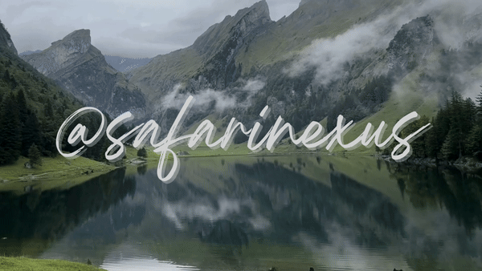

<!--
**safarinexus/safarinexus** is a ✨ _special_ ✨ repository because its `README.md` (this file) appears on your GitHub profile.

Here are some ideas to get you started:

- 🔭 I’m currently working on ...
- 🌱 I’m currently learning ...
- 👯 I’m looking to collaborate on ...
- 🤔 I’m looking for help with ...
- 💬 Ask me about ...
- 📫 How to reach me: ...
- 😄 Pronouns: ...
- ⚡ Fun fact: ...
-->
<!-- Header Photo -->

<!-- Hi there header -->
<h2 align=center>
	Hi there! I'm <a href="https://edgar-teong.vercel.app">Edgar</a></a>
</h2>
<!--profile view badge--> 

	

  
Boo! Click here for more

<!--animated header graphic open-->

<!-- ASCII Art -->
<pre>
 ___  ___   _______    ___        ___        ________           ___       __    ________   ________   ___        ________   ___       
|\  \|\  \ |\  ___ \  |\  \      |\  \      |\   __  \         |\  \     |\  \ |\   __  \ |\   __  \ |\  \      |\   ___ \ |\  \      
\ \  \\\  \\ \   __/| \ \  \     \ \  \     \ \  \|\  \        \ \  \    \ \  \\ \  \|\  \\ \  \|\  \\ \  \     \ \  \_|\ \\ \  \     
 \ \   __  \\ \  \_|/__\ \  \     \ \  \     \ \  \\\  \   ___  \ \  \  __\ \  \\ \  \\\  \\ \   _  _\\ \  \     \ \  \ \\ \\ \  \    
  \ \  \ \  \\ \  \_|\ \\ \  \____ \ \  \____ \ \  \\\  \ |\  \  \ \  \|\__\_\  \\ \  \\\  \\ \  \\  \|\ \  \____ \ \  \_\\ \\ \__\   
   \ \__\ \__\\ \_______\\ \_______\\ \_______\\ \_______\\ \  \  \ \____________\\ \_______\\ \__\\ _\ \ \_______\\ \_______\\|__|   
    \|__|\|__| \|_______| \|_______| \|_______| \|_______|_\/  /|  \|____________| \|_______| \|__|\|__| \|_______| \|_______|    ___ 
                                                         |\___/ /                                                                |\__\
                                                         \|___|/                                                                 \|__|

</pre>
<!--Animated text--> 

 

<!--About me Header-->
<h2> About Me</h2>
<!--Background Point-->
<h4> Background</h4>

Having graduated from Singapore Management University, I am currently a Software Engineer<strong></strong>.  I am deeply passionate and fiercely self-driven. I love all things technology and building solutions for problems. It is one of my goals in life to be able to use that love to make a real difference to society through software. 

When I'm not coding, you'll find me going for a nice run 🏃‍➡️, making filter/espresso coffee ☕️, hanging with friends 🎉, enjoying some films 🍿, tinkering with my split ergonomic keyboards 👐🏻, reading up about psychology/mental health stuff 📚, or dancing at my school's hip-hop dance club 🕺🏻.
 

<!--learnt subpoint--> 
<!--
<h6>📉 What I've learnt:</h6>
<ul> 
	<li>Full Stack Web Development through <a href="https://github.com/safarinexus/odin_projects">The Odin Project</a></li>
	<li>CI/CD and Containerization through <a href="https://fullstackopen.com/en/">Full Stack Open</a></li>
	<li>See the rest of the technologies I've learnt <a href="https://github.com/safarinexus#-technologies">below</a></li>
</ul>
-->
<!--learning subpoint-->
<!--
<h6>📈 What I'm currently learning/reading:</h6>
<ul> 
	<li><a href="https://www3.cs.stonybrook.edu/~skiena/373/videos/">CSE 373</a></li>
	<li><a href="https://tira.mooc.fi/spring-2025/chap01/">University of Helsinki's Data Structures & Algorithms MOOC</a></li>
</ul>
-->
<!--made subpoint--> 
<!--
<h6>🔧 What I've made, all through my own learning:</h6>
<ul>
	<li>A full-fledged <a href="https://github.com/safarinexus/edgr_odin_projects/tree/main/odin-node-express-REST-blog/backend">blog REST API</a>, with separate <a href="https://edgr-odin-blog-access.vercel.app/">post viewer frontend</a> and <a href="https://edgr-odin-blog-edit.vercel.app/">post editor frontend</a></li>
	<li><a href="https://www.edgar-teong.vercel.app">My own portfolio website and blog!</a></li>
	<li><a href="https://odin-fileuploader-production.up.railway.app/files">A Google Drive Clone</a></li>
	<li><a href="https://overseas-phoebe-safarinexus-e4f74908.koyeb.app/">A mini message board app</a></li>
	<li><a href="https://odin-projects-nine.vercel.app/">Memory card game!</a></li>
	<li><a href="https://odin-shopping-page.vercel.app/">A React-made shopping site frontend</a></li>
	<li>(Check out the rest of my stuff <a href="https://github.com/safarinexus?tab=repositories">here!</a>)</li>
</ul>
<h6>🔨 What I'm currently tinkering with:</h6>
<ul>
	<li>My own journalling/mental health app!</li>
</ul>
-->
<!-- Technologies Point-->
<h4> Technologies</h4>
<!-- Technologies Icons-->
<ul>
	<li>Frontend: 
		 
	</li>
	<li>Backend: 
		 
	</li>
	<li>Developer Tools: 
		
	</li>
</ul>
<!--github stats-->

	

<!--animated header graphic ending-->

<h1></h1>
<!-- Animated contact me -->

        

<!--social media link badges--> 

	

