<!--
**safarinexus/safarinexus** is a ✨ _special_ ✨ repository because its `README.md` (this file) appears on your GitHub profile.

Here are some ideas to get you started:

- 🔭 I’m currently working on ...
- 🌱 I’m currently learning ...
- 👯 I’m looking to collaborate on ...
- 🤔 I’m looking for help with ...
- 💬 Ask me about ...
- 📫 How to reach me: ...
- 😄 Pronouns: ...
- ⚡ Fun fact: ...
-->

<!-- Header Photo -->

<!-- Hi there header -->
<h2 align=center>Hi there! I'm <a href="https://edgr.vercel.app">Edgar</a></h2>
<!--profile view badge--> 

	

  
Boo!

<!--animated header graphic open-->

<!-- ASCII Art -->
<pre>
 ___  ___   _______    ___        ___        ________           ___       __    ________   ________   ___        ________   ___       
|\  \|\  \ |\  ___ \  |\  \      |\  \      |\   __  \         |\  \     |\  \ |\   __  \ |\   __  \ |\  \      |\   ___ \ |\  \      
\ \  \\\  \\ \   __/| \ \  \     \ \  \     \ \  \|\  \        \ \  \    \ \  \\ \  \|\  \\ \  \|\  \\ \  \     \ \  \_|\ \\ \  \     
 \ \   __  \\ \  \_|/__\ \  \     \ \  \     \ \  \\\  \   ___  \ \  \  __\ \  \\ \  \\\  \\ \   _  _\\ \  \     \ \  \ \\ \\ \  \    
  \ \  \ \  \\ \  \_|\ \\ \  \____ \ \  \____ \ \  \\\  \ |\  \  \ \  \|\__\_\  \\ \  \\\  \\ \  \\  \|\ \  \____ \ \  \_\\ \\ \__\   
   \ \__\ \__\\ \_______\\ \_______\\ \_______\\ \_______\\ \  \  \ \____________\\ \_______\\ \__\\ _\ \ \_______\\ \_______\\|__|   
    \|__|\|__| \|_______| \|_______| \|_______| \|_______|_\/  /|  \|____________| \|_______| \|__|\|__| \|_______| \|_______|    ___ 
                                                         |\___/ /                                                                |\__\
                                                         \|___|/                                                                 \|__|

</pre>
<!--Animated text--> 

 

<!--About me Header-->
<h2> About Me</h2>
<!--Background Point-->
<h4> Background</h4>

I am a Singapore Management University (SMU) graduate with the wrong degree (accountancy), now I'm an aspiring Software Engineer (Full Stack or Backend), because I truly love all things 💻 computers and technology and programming! Ever since realising I did not want to pursue accounting as a career, I've taught myself programming, development, as well as computer science fundamentals. I also really love ☕️ coffee , ⌨ mechanical keyboards, 📚 non-fiction books, 🏃🏻 running, 🧥 fashion  and 🧠 psychology.

<!--learnt subpoint--> 
<h6>📝 What I've learnt:</h6>
<ul> 
	<li>Full Stack Web Development through <a href="https://www.theodinproject.com">The Odin Project</a></li>
	<li>See the rest of the technologies I've learnt <a href="https://github.com/safarinexus#-technologies">below</a></li>
</ul>
<!--learning subpoint-->
<h6>🛠️ What I'm currently learning:</h6>
<ul> 
	<li>CI/CD, Containerization and React Native through <a href="https://fullstackopen.com/en/">Full Stack Open</a></li>
	<li>CS Theory, through <a href="https://teachyourselfcs.com/">teachyourselfcs.com</a></li>
</ul>
<!--made subpoint--> 
<h6>🪛 What I've made, all through my own learning:</h6>
<ul>
	<li>(Check out my repos <a href="https://github.com/safarinexus?tab=repositories">here!</a>)</li>
</ul>
<!-- Technologies Point-->
<h4> Technologies</h4>
<!-- Technologies Icons-->
<ul>
	<li>Frontend: 
		 
	</li>
	<li>Backend: 
		 
	</li>
	<li>Developer Tools: 
		
	</li>
</ul>
<!--animated header graphic ending-->

<!-- Animated contact me -->

        

<!--social media link badges--> 

    
    
    

